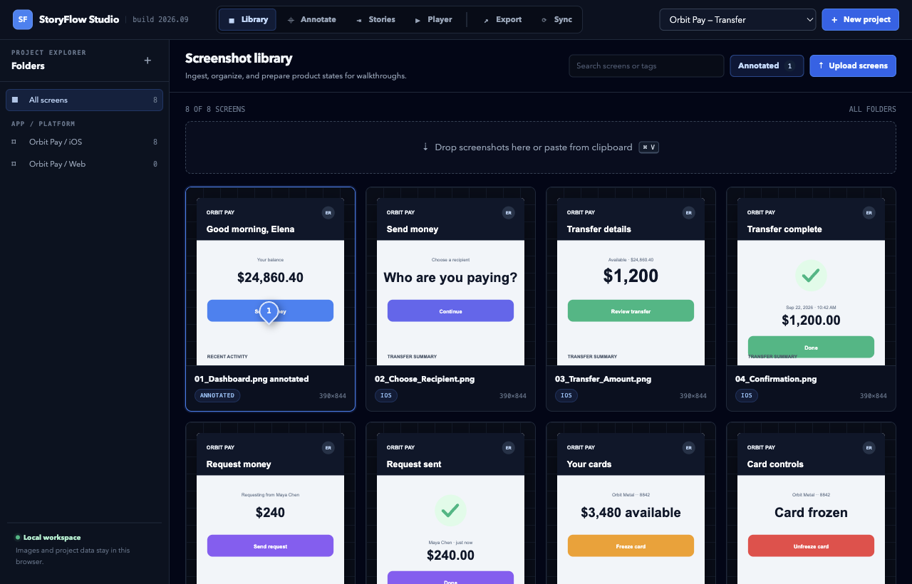
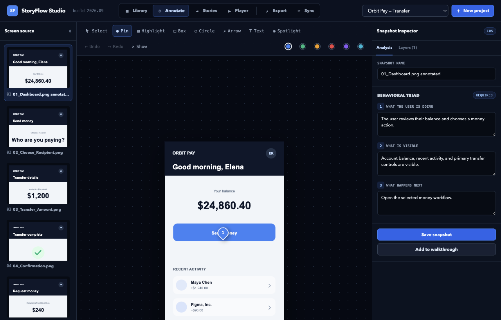
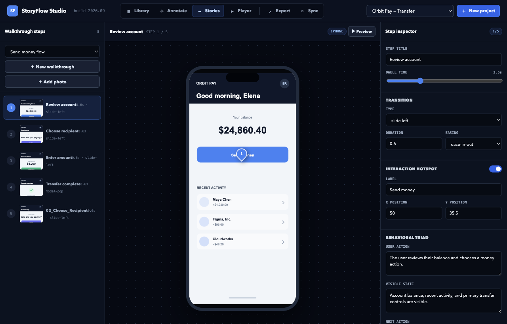
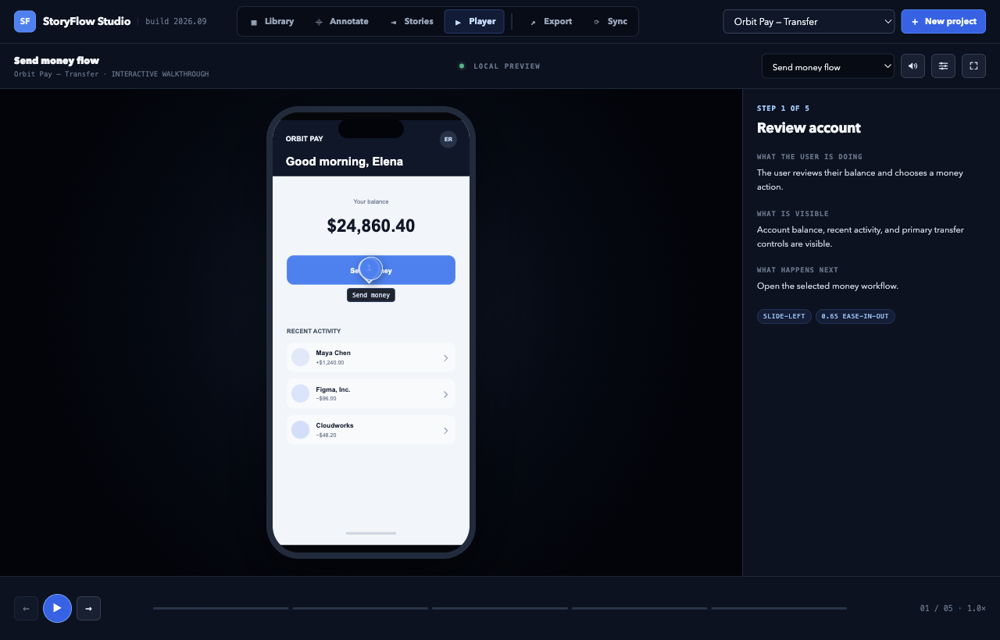
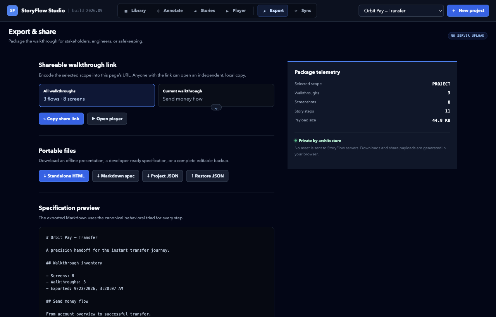

# StoryFlow Studio

By Weng (Weng Fei Fung)


<a target="_blank" href="https://github.com/Siphon880gh" rel="nofollow"></a>
<a target="_blank" href="https://www.linkedin.com/in/weng-fung/" rel="nofollow"></a>
<a target="_blank" href="https://www.youtube.com/@WengTeachesCode/" rel="nofollow"></a>

StoryFlow Studio turns product screenshots into a walkthrough you can play, narrate, and hand off. You collect screens, mark what matters, and put them in order. Each step records what the user is doing, what is on screen, and what happens next.

The app opens with a sample project, Orbit Pay, so you can click through a finished flow before adding your own screens.

## Library



Drop, paste, or upload screenshots, or choose Enter URL from the arrow beside Upload screens to add an image from the web. Folders group them by app and platform, such as Orbit Pay / iOS. The project menu sits beside New project.

## Annotate



Draw on a screen with Select, Pin, Highlight, Box, Circle, Arrow, Text, and Spotlight. The inspector keeps the screen name.

## Stories



A walkthrough is an ordered list of steps. Set the dwell time, the transition, and the hotspot, then preview the flow.

## Player



Play the walkthrough inside a device frame. Narration reads the step aloud. Mute and narration settings, the sliders icon, live in the player header. Speech stops when you leave the player or switch to another project or walkthrough. Underscores, dashes, and similar separators in a slip name are skipped when they are spoken.

## Export and Sync



Copy a share link, or download a standalone HTML player, a Markdown spec, or a JSON backup. Sync sits beside Export, set off by a divider. Its only action is Sync to Demo, which warns that the project will appear to all current users of this server.

## Run it

PHP 8 is enough. From this folder:

```bash
php -S 127.0.0.1:8080
```

Open http://127.0.0.1:8080. Library, Annotate, Stories, Player, and Export keep their place in the address after a hash: `#library`, `#annotate`, `#stories`, `#player`, and `#export`.

Projects and narration settings stay in the browser. Uploaded screenshots are saved on this server in `data/screenshots`, named with a hash of the file. Sync to Demo is the shared copy: it saves one demo on the machine running PHP so other open sessions can load it.
