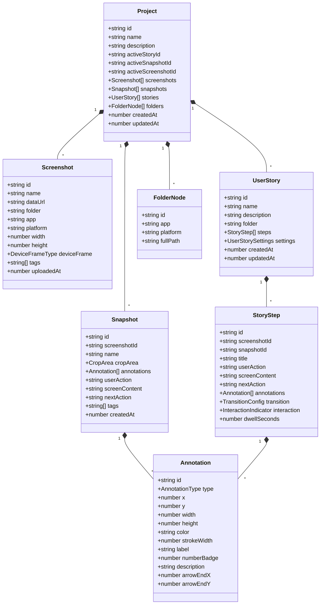

# Architecture Specification: StoryFlow Studio

## 1. Purpose and Boundaries

StoryFlow Studio is a client-side web application for analyzing, annotating, and sequencing application screenshots into animated user flows and interactive playback walkthroughs. It serves product managers, UI/UX designers, and software engineers who need to document interface journeys, state transitions, and interaction triggers without managing external server infrastructure. The entire application executes in modern browser environments as a React single-page application (SPA). Its primary capabilities include screenshot ingestion via clipboard paste, drag-and-drop, and file upload; vector canvas annotations with normalized coordinate mapping; narrative behavioral triad authoring (*userAction*, *screenContent*, *nextAction*); transition and interaction hotspot configuration; hardware frame simulation (iPhone, Android, Desktop); Web Speech API voice narration; and serverless export/sharing through LZ-String compressed URL hash payloads, standalone single-file HTML presentations, and Markdown specifications.

---

## 2. Technology Stack

| Category | Technology | Declared Version Range (`package.json`) | Resolved Version (`bun.lock`) | Role & Source Evidence |
| :--- | :--- | :--- | :--- | :--- |
| **Client Runtime** | Modern Web Browser | Standards compliant (ES2022+) | Unverified (client platform) | Host execution environment supporting HTML5 Canvas, Web Speech API, LocalStorage, and Fullscreen API. |
| **Development Runtime** | Node.js / Bun | Unverified | Unverified | Dev tooling and build runner environment. |
| **UI Framework** | React | `^19.0.1` | `19.0.1` | Core reactive component framework (`src/main.tsx`, `src/App.tsx`). |
| **UI Framework (DOM)** | ReactDOM | `^19.0.1` | `19.0.1` | Browser DOM renderer for React. |
| **Language** | TypeScript | `^7.0.2` (dev) | `5.7.2` | Static type checking and interface modeling (`src/types/index.ts`, `tsconfig.json`). |
| **Styling & Design** | Tailwind CSS / Vite Plugin | `^4.3.3` | `4.3.3` | Utility-first styling with custom CSS variables (`@import "tailwindcss"`, `src/index.css`, `vite.config.ts`). |
| **Iconography** | Lucide React | `^0.546.0` | `0.546.0` | SVG iconography across toolbars, sidebars, and control panels. |
| **Animation Library** | Motion | `^12.23.24` | `12.23.24` | Motion and physics primitives for UI transitions. |
| **Compression / URL Codec**| LZ-String | `^1.5.0` | `1.5.0` | URI-safe compression for zero-backend URL walkthrough sharing (`src/utils/shareUtils.ts`). |
| **Type Definitions** | `@types/lz-string` | `^1.5.0` | `1.5.0` | Type declarations for LZ-String. |
| **Type Definitions** | `@types/node` | `^22.14.0` (dev) | `22.14.0` | Node.js type declarations for build tools. |
| **Type Definitions** | `@types/react`, `@types/react-dom` | `^19.3.0` (dev) | `19.3.0` | React 19 type bindings. |
| **Bundler & Dev Server** | Vite | `^8.3.0` | `8.3.0` | Frontend build tooling and local development server (`vite.config.ts`). |
| **Vite React Plugin** | `@vitejs/plugin-react` | `^6.1.1` | `6.1.1` | Fast refresh and JSX compilation plugin for Vite. |
| **CSS Autoprefixer** | Autoprefixer | `^10.4.21` (dev) | `10.4.21` | CSS vendor prefix generation. |
| **TypeScript Runner** | TSX | `^4.21.0` (dev) | `4.21.0` | TypeScript execution tooling for node scripts. |
| **Bundler Core** | ESBuild | `^0.25.0` (dev) | `0.25.0` | JavaScript/TypeScript transpilation engine used by Vite. |
| **Authentication** | None | Absent | Absent | **Confirmed absent**: The applet operates without user accounts or login tokens. |
| **Remote Database** | None | Absent | Absent | **Confirmed absent**: No remote database (Postgres, Firebase, Firestore, etc.) is connected. |
| **Local Persistence** | Browser `localStorage` | Browser native API | Browser native API | Storage for projects (`storyflow_projects_v1`), active project pointer, and audio settings (`storyflow_audio_settings_v1`). |
| **Declared Unused: GenAI**| `@google/genai` | `^2.4.0` | `2.4.0` | **Unused dependency**: Declared in `package.json` and permitted in `metadata.json`, but currently unimported and unused in `src/`. |
| **Declared Unused: Express**| `express`, `dotenv`, `@types/express` | `^4.21.2`, `^17.2.3`, `^4.17.21`| `4.21.2`, `17.2.3`, `4.17.21` | **Unused dependency**: No backend Express server script is active or referenced in `package.json` `"dev"` script. |

---

## 3. Codebase Layout

```
/
├── index.html                           # Application HTML entry point, Google Fonts, meta tags
├── metadata.json                        # AI Studio applet manifest (permissions, title, capabilities)
├── package.json                         # NPM dependencies and build/dev script configurations
├── tsconfig.json                        # TypeScript compiler options (target: ES2022, module: ESNext)
├── vite.config.ts                       # Vite bundler configuration, path aliases, HMR guards
├── .env.example                         # Environment variable documentation template
├── .gitignore                           # Git ignore rules
├── public/                              # Static public assets
│   └── assets/aistudio/
├── .agents/skills/                      # Locally installed AI agent skills
│   └── impeccable/                      # Impeccable design system engineering skill
└── src/                                 # Application source code
    ├── main.tsx                         # React 19 root mounting entry point
    ├── App.tsx                          # Root application container, state store, and view router
    ├── index.css                        # Tailwind CSS imports, font declarations, custom scrollbars
    ├── types/
    │   └── index.ts                     # Core domain interfaces (Project, Screenshot, Story, Step)
    ├── components/
    │   ├── TopBar.tsx                   # Header, project switcher, new project dialog, view navigation
    │   ├── FolderSidebar.tsx            # Two-tier app/platform folder tree explorer
    │   ├── ScreenshotGallery.tsx        # Screenshot grid, drag-drop, paste ingest, search, reordering
    │   ├── AnnotationStudio.tsx         # Vector canvas drawing workbench & analytical note capture
    │   ├── StoryBuilder.tsx             # Step timeline sequencer, motion transitions, hotspot editor
    │   ├── PlaybackPlayer.tsx           # Fullscreen interactive player, hardware bezels, speech engine
    │   ├── ExportView.tsx               # Markdown, standalone HTML, JSON backup, and URL sharing
    │   └── AudioSettingsModal.tsx       # Web Speech API voice selection, rate/pitch/volume configuration
    └── utils/
        ├── storage.ts                   # LocalStorage read/write serialization and error fallbacks
        ├── seedData.ts                  # Default demonstration projects (Orbit Pay, Aura AI Suite)
        ├── mockScreens.ts               # Programmatically generated self-contained SVG vector mockups
        ├── imageUtils.ts                # FileReader image conversion to base64 Data URLs and sizing
        ├── shareUtils.ts                # LZ-String compression/decompression for #player= / #flow= URLs
        └── speechUtils.ts               # Web Speech API wrapper, voice prioritization, step utterance builder
```

---

## 4. Runtime Architecture and Lifecycle

### Architecture Diagram

```mermaid
flowchart TD
    subgraph Browser Client [Browser Client (Single Page Application)]
        User[User / Collaborator]
        
        subgraph Ingestion Layer
            FileInput[File Input]
            DragDrop[Drag & Drop Zone]
            PasteListener[Global Window Paste Listener]
            FileReaderAPI[FileReader API]
        end
        
        subgraph Core Application State [App.tsx State Root]
            ProjectsState[projects: Project[]]
            ActiveProjState[activeProjectId: string]
            ActiveViewState[currentView: ActiveAppView]
            ActiveFolderState[selectedFolder: string | null]
        end

        subgraph Local Storage [Browser LocalStorage]
            StorageProjects[Key: storyflow_projects_v1]
            StorageActive[Key: storyflow_active_project_id_v1]
            StorageAudio[Key: storyflow_audio_settings_v1]
        end

        subgraph View Components
            ScreenshotsView[ScreenshotGallery + FolderSidebar]
            EditorView[AnnotationStudio]
            StoryView[StoryBuilder]
            PlayerView[PlaybackPlayer]
            ExportViewComp[ExportView]
        end

        subgraph Browser Services
            SpeechAPI[Web Speech Synthesis API]
            LZStringCodec[LZ-String Compression / Decompression]
            ClipboardAPI[Navigator Clipboard API]
            URLHash[window.location.hash]
        end
    end

    User -->|Files / Drag / Paste| IngestionLayer
    FileInput & DragDrop & PasteListener --> FileReaderAPI
    FileReaderAPI -->|base64 Data URL| ProjectsState

    ProjectsState <-->|Auto-save / Initialize| LocalStorage
    ActiveProjState <-->|Auto-save / Initialize| LocalStorage

    ProjectsState --> ViewComponents
    ActiveViewState -->|Switches Active View| ViewComponents

    PlayerView --> SpeechAPI
    PlayerView & ExportViewComp --> LZStringCodec
    LZStringCodec --> URLHash
    URLHash -->|Incoming shared walkthrough| App.tsx
    ExportViewComp --> ClipboardAPI
```

### Execution Order and Startup Lifecycle

1. **Bootstrap (`src/main.tsx`)**:
   - `ReactDOM.createRoot` mounts `<App />` wrapped in `<StrictMode>` onto the `#root` element in `index.html`.
2. **State Initialization (`src/App.tsx`)**:
   - `loadProjectsFromStorage()` is called synchronously inside `useState` initializers:
     - Reads `localStorage.getItem('storyflow_projects_v1')`.
     - Reads `localStorage.getItem('storyflow_active_project_id_v1')`.
     - If stored data exists and parses as a non-empty array, it initializes state from `localStorage`.
     - If empty, corrupt, or missing, it falls back to `createDefaultProjects()` (`src/utils/seedData.ts`) and writes defaults to `localStorage`.
3. **URL Share Payload Ingestion (`useEffect` on mount)**:
   - `parseSharedFlowFromUrl()` inspects `window.location.hash` and `window.location.search` for `player=`, `flow=`, or `share=` query/hash keys.
   - If present:
     - Extracts the encoded string and runs `LZString.decompressFromEncodedURIComponent()`.
     - Validates payload structure (`version`, `projectName`, `screenshots`, `stories` / `story`).
     - Constructs an ephemeral imported `Project` (`id: shared-proj-${Date.now()}`).
     - Prepends the shared project to `projects` state, sets it as active, routes `currentView` to `'player'`, and invokes `clearShareUrlHash()` using `history.replaceState` to cleanly restore browser history.
4. **Active Project & Item Derivation**:
   - Resolves `activeProject = projects.find(...) || projects[0]`.
   - Resolves `activeStory = activeProject.stories.find(...) || activeProject.stories[0]`.
   - Resolves `activeScreenshot = activeProject.screenshots.find(...) || activeProject.screenshots[0]`.
   - Resolves `activeSnapshot = activeProject.snapshots.find(...) || null`.
5. **Persistence Effect**:
   - Whenever `projects` or `activeProjectId` changes, `useEffect` invokes `saveProjectsToStorage(projects, activeProject.id)` to serialize the complete state graph to `localStorage`.

---

## 5. Domain Model

The core domain model is defined in `src/types/index.ts`. All entities use immutable JavaScript object structures with Unix timestamp identifiers.



### Entity Specifications

#### 1. `Project`
- **Fields**:
  - `id`: String. Unique ID format: `proj-${Date.now()}` or `shared-proj-${Date.now()}`.
  - `name`: String. Display name of the project.
  - `description`: String. Contextual description.
  - `activeStoryId`: String. Foreign key referencing the active `UserStory`.
  - `activeScreenshotId`: Optional string. Foreign key referencing the active `Screenshot`.
  - `activeSnapshotId`: Optional string. Foreign key referencing the active `Snapshot`.
  - `screenshots`: `Screenshot[]`.
  - `snapshots`: `Snapshot[]`.
  - `stories`: `UserStory[]`.
  - `folders`: `FolderNode[]`.
  - `createdAt`, `updatedAt`: Unix millisecond timestamps.

#### 2. `Screenshot`
- **Fields**:
  - `id`: String. Unique ID format: `screen-${Date.now()}-${index}`.
  - `name`: String. Filename (e.g., `01_Dashboard.png`).
  - `dataUrl`: String. Data URL containing base64 image data (`data:image/png;base64,...`) or SVG data URI (`data:image/svg+xml;utf8,...`).
  - `folder`: String. Combined path formatted as `"${app} / ${platform}"`.
  - `app`: String. Application name.
  - `platform`: String. Platform name (e.g., `'iOS'`, `'Web'`, `'Android'`).
  - `width`: Number. Natural pixel width.
  - `height`: Number. Natural pixel height.
  - `deviceFrame`: Enum: `'iphone' | 'android' | 'desktop' | 'none'`.
  - `tags`: `string[]`. Lowercase metadata tags.
  - `uploadedAt`: Unix millisecond timestamp.

#### 3. `Snapshot`
- **Fields**:
  - `id`: String. Unique ID format: `snap-${Date.now()}`.
  - `screenshotId`: String. Foreign key to parent `Screenshot`.
  - `name`: String. Name of the snapshot view.
  - `cropArea`: Optional crop rectangle `{ x, y, width, height }` in percentages.
  - `annotations`: `Annotation[]`. Array of visual annotations.
  - `userAction`: String. Behavioral description of what the user is doing.
  - `screenContent`: String. Description of what is visible on the screen.
  - `nextAction`: String. Description of the expected subsequent action.
  - `tags`: `string[]`.
  - `createdAt`: Unix millisecond timestamp.

#### 4. `UserStory`
- **Fields**:
  - `id`: String. Unique ID format: `story-${Date.now()}`.
  - `name`: String. Flow name.
  - `description`: String. Flow description.
  - `folder`: String. Target folder association.
  - `steps`: `StoryStep[]`. Ordered array of walkthrough steps.
  - `settings`: `UserStorySettings`:
    - `defaultSpeed`: Number (`0.5 | 1 | 1.5 | 2`).
    - `autoAdvance`: Boolean.
    - `interactiveHotspots`: Boolean.
    - `showDeviceMockup`: Boolean.
    - `deviceType`: `DeviceFrameType`.
  - `createdAt`, `updatedAt`: Unix millisecond timestamps.

#### 5. `StoryStep`
- **Fields**:
  - `id`: String. Unique ID format: `step-${Date.now()}`.
  - `screenshotId`: String. Foreign key to the `Screenshot` asset.
  - `snapshotId`: Optional string. Foreign key to originating `Snapshot`.
  - `title`: String. Step header label.
  - `userAction`: String. Narrative triad part 1.
  - `screenContent`: String. Narrative triad part 2.
  - `nextAction`: String. Narrative triad part 3.
  - `annotations`: `Annotation[]`. Step-specific annotations.
  - `transition`: `TransitionConfig`:
    - `type`: Enum: `'none' | 'fade' | 'slide-left' | 'slide-right' | 'slide-up' | 'slide-down' | 'scroll-down' | 'scroll-up' | 'tap-zoom' | 'modal-pop'`.
    - `duration`: Number in seconds (default: `0.6`).
    - `easing`: Enum: `'linear' | 'ease' | 'ease-in-out' | 'spring'`.
    - `scrollDistancePx`: Optional number (default: `300`).
  - `interaction`: `InteractionIndicator`:
    - `enabled`: Boolean.
    - `type`: Enum: `'tap' | 'cursor-click' | 'swipe-up' | 'swipe-left' | 'swipe-right' | 'highlight-box'`.
    - `xPercent`, `yPercent`: Numbers (0–100). Hotspot coordinates.
    - `endXPercent`, `endYPercent`: Optional numbers for swipe vectors.
    - `label`: Optional string.
  - `dwellSeconds`: Number. Dwell time before auto-advancing (default: `3.5`).

#### 6. `Annotation`
- **Fields**:
  - `id`: String. Unique ID format: `ann-${Date.now()}-${random}`.
  - `type`: Enum: `'highlight' | 'rectangle' | 'arrow' | 'callout-pin' | 'text-box' | 'spotlight'`.
  - `x`, `y`: Numbers (0–100). Percentage offset from canvas origin (top-left).
  - `width`, `height`: Numbers (0–100). Percentage dimensions.
  - `color`: Hex color string (`#3B82F6`, `#10B981`, etc.).
  - `strokeWidth`: Number in pixels (1–8).
  - `label`: Optional string.
  - `numberBadge`: Optional integer number.
  - `description`: Optional text.
  - `arrowEndX`, `arrowEndY`: Optional endpoint coordinates for arrows.

---

## 6. Persistence, Asset Lifecycle, and Data Integrity

### Storage Stores Inventory

| Store Name | Storage Engine | Scope & Callers | Keys / Patterns | Content Schema | Retention / Survival |
| :--- | :--- | :--- | :--- | :--- | :--- |
| **Projects Store** | Browser `localStorage` | Global; managed by `storage.ts` | `storyflow_projects_v1` | Serialized JSON array of `Project[]`. | Survives page refresh and browser restarts; deleted on clearing site data. |
| **Active Project Key** | Browser `localStorage` | Global; managed by `storage.ts` | `storyflow_active_project_id_v1` | String representing active `Project.id`. | Survives page refresh. |
| **Audio Settings Store** | Browser `localStorage` | Global; managed by `speechUtils.ts` | `storyflow_audio_settings_v1` | Serialized JSON of `AudioNarrationSettings`. | Survives page refresh. |
| **Volatile State** | React Component Memory | Per session in `App.tsx` | N/A | Current view, selected folder, drawing coordinates, playback timer. | Cleared on page refresh. |

### Binary & Image Asset Lifecycle
- **Byte Ingestion**: When an image file is dropped, selected, or pasted, `fileToDataUrl(file)` (`src/utils/imageUtils.ts`) reads the binary buffer using `FileReader.readAsDataURL(file)`.
- **Dimensions Extraction**: An in-memory `new Image()` is loaded asynchronously to sample `naturalWidth` and `naturalHeight`.
- **Format Storage**: The entire image is converted into an inline base64 string (`data:image/...;base64,...`) and stored directly within `Screenshot.dataUrl`. Mock screens use raw SVG Data URIs (`data:image/svg+xml;utf8,...`).
- **Storage Limits**:
  - Browser `localStorage` enforces a platform quota (typically 5MB to 10MB per origin).
  - Storing multiple high-resolution base64 PNGs can exhaust `localStorage` quota. When `localStorage.setItem` throws `QuotaExceededError`, `storage.ts` logs an error via `console.error` without crashing the in-memory React session.
  - The application provides Standalone HTML and JSON export features as the recommended persistent backup mechanism for large screenshot repositories.
- **Cascading Deletion**:
  - When a `Screenshot` is deleted (`handleDeleteScreenshot` in `App.tsx`):
    1. The screenshot is removed from `project.screenshots`.
    2. All linked `Snapshot` records (`s.screenshotId === id`) are purged.
    3. All linked `StoryStep` items across all stories (`step.screenshotId === id`) are purged.
    4. Active screenshot ID is updated to the first remaining screenshot.

---

## 7. Interfaces, Integrations, and Access Control

### 1. LZ-String URL Sharing Interface
- **Trigger**: Generated in `ExportView.tsx` and `PlaybackPlayer.tsx` via `generateProjectPlayerShareableUrl()` or `generateSingleFlowShareableUrl()`.
- **URL Schema**:
  - Multi-flow project link: `https://<host>/<path>#player=<compressedPayload>`
  - Single walkthrough link: `https://<host>/<path>#flow=<compressedPayload>`
- **Payload Schema (`SharedFlowPayload`)**:
  ```typescript
  {
    version: 2,
    projectName: string,
    mode: 'all' | 'single',
    stories: UserStory[],
    activeStoryId?: string,
    story?: UserStory,
    screenshots: Screenshot[], // Filtered to only required screenshots
    sharedAt: number
  }
  ```
- **Codec**: `LZString.compressToEncodedURIComponent(json)` -> URI safe base64-like string.

### 2. Browser Web Speech Synthesis Integration
- **Trigger**: Activated in `PlaybackPlayer.tsx` when `audioSettings.enabled === true`.
- **API Boundary**: Standard `window.speechSynthesis` and `SpeechSynthesisUtterance`.
- **Voice Resolution Priority**:
  1. User-configured `voiceUri`.
  2. "Google US English" (`en-US` / `en_US`).
  3. Any Google English voice.
  4. Any `en-US` system voice (e.g., Samantha, David).
  5. Any English voice (`lang.startsWith('en')`).
  6. System default voice (`v.default === true`).
- **Narrative Assembly**: `buildStepNarration` concatenates step title, user action, screen content, and next action based on granular user toggles.

### 3. Access Control & Trust Boundaries
- **Client-Side Sandbox**: All operations execute within the user's browser sandbox.
- **Authentication**: None. No API keys, JWT tokens, or credentials are required or stored.
- **Network Boundary**: The application makes zero outbound HTTP/REST network requests during runtime. All assets, SVGs, fonts, and scripts are self-contained or loaded from standard CDNs (Google Fonts).

---

## 8. Absent Capabilities and Unresolved Dependencies

### Confirmed Absent Capabilities
1. **No Backend API Server**: Although `express` and `dotenv` exist in `package.json`, there is no active `server.ts` or Node backend running in production. Vite serves the SPA static files directly.
2. **No User Authentication / Accounts**: The system has no login screen, session tokens, or multi-tenant database partitioning.
3. **No Cloud Database Persistence**: Data does not sync to Firestore, Cloud SQL, Supabase, or any cloud datastore. Refreshing in a separate browser or incognito profile initializes default seed data.
4. **No Real-Time Collaboration**: There are no WebSockets, WebRTC channels, or CRDTs for multi-user concurrent editing.

### Inactive / Unused Dependencies in Codebase
1. **`@google/genai` (`^2.4.0`)**: Listed in `dependencies` and declared in `metadata.json` (`MAJOR_CAPABILITY_SERVER_SIDE_GEMINI_API`), but there are no imports or API calls in `src/`.
2. **`express` (`^4.21.2`)**: Listed in `dependencies` but unused by Vite build or dev scripts.
3. **`dotenv` (`^17.2.3`)**: Listed in `dependencies` but unused.
