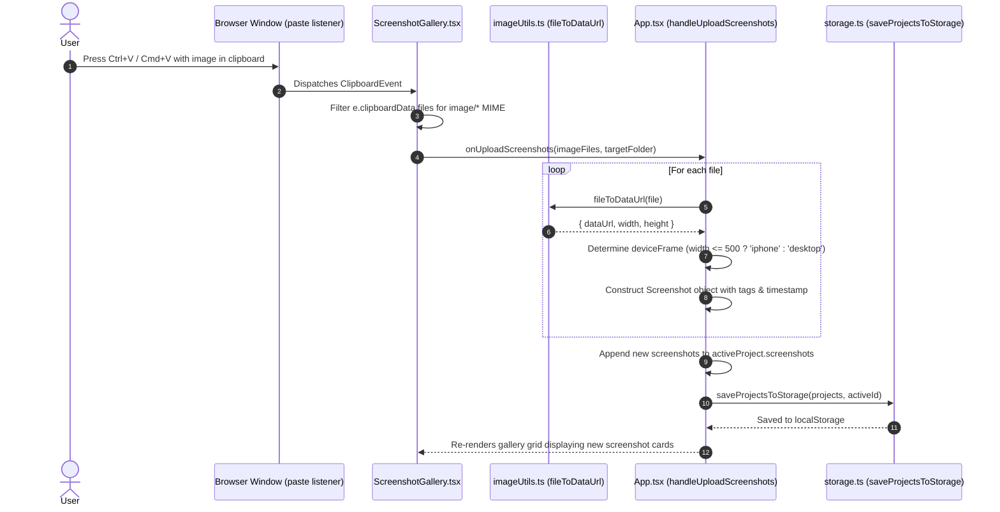
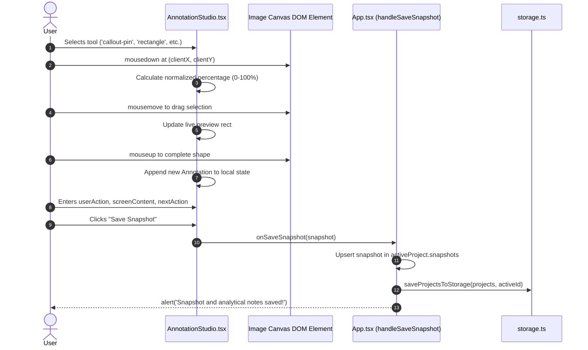

# Behavioral Specification: StoryFlow Studio

## 1. Feature and Workflow Inventory

| Capability / Workflow | Primary Actor | Entry Point / UI Trigger | Implementation Location | Persistence & Side Effects |
| :--- | :--- | :--- | :--- | :--- |
| **Project Creation** | User | `TopBar.tsx` -> "New Project" button | `src/App.tsx` (`handleCreateProject`) | Creates new `Project` with initial flow and Web/Mobile folders; saves to `localStorage`. |
| **Project Switching** | User | `TopBar.tsx` -> Project dropdown menu | `src/App.tsx` (`setActiveProjectId`) | Updates `activeProjectId` and clears folder filter. |
| **Folder Organization** | User | `FolderSidebar.tsx` -> "+" button | `src/App.tsx` (`handleAddFolder`, `handleDeleteFolder`) | Adds folder path or deletes with cascade remapping of orphan screenshots. |
| **Screenshot Upload (File)** | User | `ScreenshotGallery.tsx` -> "Upload Screens" button | `src/App.tsx` (`handleUploadScreenshots`) | Converts files to Data URLs, determines frame (`iphone` vs `desktop`), appends to project. |
| **Screenshot Ingest (Paste)** | User | Global `paste` event listener (`Ctrl+V` / `Cmd+V`) | `ScreenshotGallery.tsx` (`useEffect`) | Intercepts clipboard image buffer and uploads to current folder. |
| **Screenshot Drag & Drop** | User | Drag files over `ScreenshotGallery.tsx` | `ScreenshotGallery.tsx` (`handleDrop`) | Processes dropped image files into the active folder. |
| **Screenshot Reordering** | User | Drag grip handle on screenshot card | `ScreenshotGallery.tsx` (`handleReorderScreenshots`) | Reorders array in-place; updates `project.screenshots`. |
| **Screenshot Duplication** | User | Screenshot card -> Copy button | `src/App.tsx` (`handleDuplicateScreenshot`) | Copies screenshot and any attached snapshot with regenerated IDs. |
| **Screenshot Deletion** | User | Screenshot card -> Trash button | `src/App.tsx` (`handleDeleteScreenshot`) | Cascades deletion to linked snapshots and story steps. |
| **Annotation Drawing** | User | Canvas mousedown/move/up in `AnnotationStudio.tsx` | `AnnotationStudio.tsx` (`handleMouseUp`) | Normalized 0–100% vector coordinate calculation and shape creation. |
| **Snapshot Saving** | User | `AnnotationStudio.tsx` -> "Save Snapshot" button | `src/App.tsx` (`handleSaveSnapshot`) | Upserts snapshot record; triggers browser notification. |
| **Add to Walkthrough** | User | `AnnotationStudio.tsx` or Gallery -> "Add to Story" | `src/App.tsx` (`handleAddSnapshotToStory`, `handleAddScreenshotToStory`) | Appends `StoryStep` to `activeStory.steps` and switches view to `'stories'`. |
| **Step Motion Setup** | User | `StoryBuilder.tsx` -> Transition select / sliders | `StoryBuilder.tsx` (`updateStep`) | Sets transition type, duration, easing, and scroll distance. |
| **Step Reordering** | User | `StoryBuilder.tsx` -> Left / Right move buttons | `StoryBuilder.tsx` (`moveStep`) | Swaps step array indices in `activeStory.steps`. |
| **Interactive Playback** | User | `PlaybackPlayer.tsx` -> Play / Pause button | `PlaybackPlayer.tsx` (50ms interval loop) | Runs animated timer; triggers CSS transition at step boundaries. |
| **Hotspot Click Navigation** | User | Click on pulsing hotspot in `PlaybackPlayer.tsx` | `PlaybackPlayer.tsx` (`handleHotspotClick`) | Displays click ping ripple animation and advances to next step immediately. |
| **Audio Voice Narration** | User / Auto | `PlaybackPlayer.tsx` -> Sound icon / Auto-advance | `src/utils/speechUtils.ts` (`speakNarration`) | Synthesizes and vocalizes step narrative via `window.speechSynthesis`. |
| **Voice Audio Settings** | User | `PlaybackPlayer.tsx` -> Settings icon | `AudioSettingsModal.tsx` | Saves voice choice, rate, pitch, and speech toggles to `localStorage`. |
| **Single Flow URL Share** | User | Player or Export -> "Copy Share Link" | `src/utils/shareUtils.ts` (`generateSingleFlowShareableUrl`) | Compresses flow & required screenshots into `#flow=<compressed>` URL. |
| **Project Player URL Share**| User | Export View -> "Copy Share Link" (All Flows) | `src/utils/shareUtils.ts` (`generateProjectPlayerShareableUrl`) | Compresses all flows into `#player=<compressed>` URL. |
| **URL Share Ingestion** | Visitor | Load URL with `#player=` or `#flow=` | `src/App.tsx` (`useEffect` on mount) | Decompresses payload, instantiates temporary project, opens Player view. |
| **Markdown Export** | User | `ExportView.tsx` -> "Copy Markdown" / Download | `ExportView.tsx` (`generateMarkdownDoc`) | Generates structured Markdown specification with Triad details. |
| **Standalone HTML Export**| User | `ExportView.tsx` -> "Download HTML File" | `ExportView.tsx` (`handleDownloadInteractiveHtml`) | Generates standalone single-file HTML/CSS/JS presentation document. |
| **JSON Backup & Restore** | User | `ExportView.tsx` -> Download / Upload JSON | `ExportView.tsx` (`handleImportProject`) | Serializes complete project or parses and replaces matching project ID. |

---

## 2. Workflow Specifications & Execution Traces

### Workflow 1: Screenshot Ingest via System Clipboard Paste



#### Execution Trace
1. **Trigger**: User focuses the application window and executes `Cmd+V` or `Ctrl+V`.
2. **Event Capture** (`src/components/ScreenshotGallery.tsx:59-77`): The `paste` event listener attached to `window` intercepts the event. It reads `e.clipboardData.files` and filters for MIME types starting with `image/`.
3. **Dispatch**: If one or more images exist, it invokes `onUploadScreenshots(imageFiles, currentTargetFolder)` where `currentTargetFolder` is the currently selected folder or `${project.name} / Web`.
4. **Binary Processing** (`src/utils/imageUtils.ts:1-26`): Inside `App.tsx:209-250`, each file is passed to `fileToDataUrl(file)`. A `FileReader` converts the binary buffer into a base64 Data URL. An in-memory HTML `Image` loads the Data URL to determine `naturalWidth` and `naturalHeight`.
5. **Frame Categorization**: If `width <= 500`, `deviceFrame` is assigned `'iphone'`; otherwise, `'desktop'`.
6. **State Mutation**: The newly constructed `Screenshot` records are appended to `activeProject.screenshots`. `activeScreenshotId` is set to the first uploaded screenshot ID.
7. **Persistence**: The updated project graph is saved to `localStorage` under `storyflow_projects_v1`.

---

### Workflow 2: Drawing Vector Annotations & Analytical Triad Capture



#### Execution Trace
1. **Trigger**: User selects an annotation tool from the toolbar (e.g., `highlight`, `rectangle`, `arrow`, `callout-pin`) and interacts with the image canvas.
2. **Coordinate Normalization** (`src/components/AnnotationStudio.tsx:111-117`):
   ```typescript
   x = Math.max(0, Math.min(100, ((e.clientX - rect.left) / rect.width) * 100));
   y = Math.max(0, Math.min(100, ((e.clientY - rect.top) / rect.height) * 100));
   ```
3. **Drawing Interaction**:
   - `onMouseDown`: Records start coordinate `drawStart` and sets `isDrawing = true`.
   - `onMouseMove`: Computes current drag bounding box or arrow endpoint.
   - `onMouseUp`: Instantiates an `Annotation` object with unique ID `ann-${Date.now()}-${random}`, selected color, stroke width, and shape-specific parameters (e.g., `numberBadge: annotations.length + 1` for callout pins).
4. **Analytical Triad Entry**: User edits input fields:
   - `userAction`: What the user is doing.
   - `screenContent`: Visible components on screen.
   - `nextAction`: What should happen next.
5. **Snapshot Persistence** (`src/App.tsx:386-402`): Clicking "Save Snapshot" invokes `handleSaveSnapshot(snapshot)`. The snapshot is upserted into `activeProject.snapshots`, saved to `localStorage`, and confirmed via a browser alert dialog.

---

### Workflow 3: Interactive Playback & Automated Audio Narration

```mermaid
sequenceDiagram
    autonumber
    actor User
    participant Player as PlaybackPlayer.tsx
    participant Timer as 50ms Interval Loop
    participant Speech as speechUtils.ts (speakNarration)
    participant WebSpeech as window.speechSynthesis

    User->>Player: Clicks "Play" button
    Player->>Player: setIsPlaying(true)
    
    rect rgb(20, 25, 40)
        Note over Player,Timer: Dwell Progress Loop
        loop Every 50ms
            Timer->>Player: setStepProgress(prev + progressIncrement)
            alt Progress >= 100%
                Player->>Player: goToNextStep()
            end
        end
    end

    opt Audio Narration Enabled
        Player->>Speech: buildStepNarration(currentStep, settings)
        Speech->>WebSpeech: cancel() & speak(utterance)
        WebSpeech-->>Speech: onend() callback
        opt advanceOnSpeechEnd Enabled
            Speech->>Player: goToNextStep()
        end
    end

    alt User Clicks Hotspot
        User->>Player: Clicks interactive hotspot indicator
        Player->>Player: Trigger ripple ping animation (setClickPing)
        Player->>Player: goToNextStep() immediately
    end

    Player->>Player: triggerTransition(nextIndex) -> CSS transition applied
```



#### Execution Trace
1. **Trigger**: User navigates to the Player view and clicks "Play".
2. **Dwell Timer** (`src/components/PlaybackPlayer.tsx:204-228`):
   - Computes `stepDurationMs = (currentStep.dwellSeconds * 1000) / speed`.
   - Runs a `setInterval` every 50ms, incrementing `stepProgress` by `(50 / stepDurationMs) * 100`.
   - When `stepProgress >= 100`, it invokes `goToNextStep()`.
3. **Audio Utterance Generation** (`src/utils/speechUtils.ts:148-232`):
   - If `audioSettings.enabled === true`, `buildStepNarration` combines configured sections into a single speech string.
   - `speakNarration()` cancels any in-flight utterance, resolves the preferred voice, binds `utterance.rate`, `pitch`, and `volume`, and calls `window.speechSynthesis.speak(utterance)`.
   - If `advanceOnSpeechEnd === true`, the utterance `onend` callback triggers `goToNextStep()` immediately upon speech completion.
4. **Hotspot Interactivity**:
   - If the user clicks directly on the rendered hotspot (`handleHotspotClick`), coordinates are captured for a radial ping animation (`setClickPing`), speech is canceled, and the player advances to the next step.
5. **Transition Choreography**:
   - `triggerTransition(targetIndex)` sets `isTransitioning = true`.
   - The CSS transform corresponding to `step.transition.type` (`slide-left`, `scroll-down`, `modal-pop`, etc.) is applied to the frame container for `transition.duration / speed`.
   - After `duration / 2`, `currentStepIndex` updates to `targetIndex` and `isTransitioning` reverts to `false`.

---

### Workflow 4: URL Hash Walkthrough Sharing & Ingestion

#### Sharing Path (`src/components/ExportView.tsx:42-50`)
1. User selects share scope: **"All Walkthrough Flows"** (`#player=`) or **"Single Flow"** (`#flow=`).
2. `generateProjectPlayerShareableUrl()` or `generateSingleFlowShareableUrl()` runs:
   - Collects only the `Screenshot` objects required by the target story steps to minimize payload size.
   - Serializes payload to JSON string.
   - Compresses string using `LZString.compressToEncodedURIComponent(jsonStr)`.
   - Constructs target URL: `${origin}${pathname}#player=${compressed}` or `#flow=`.
3. Link is copied to system clipboard with a 2.5s visual "Copied!" feedback indicator.

#### Ingestion Path (`src/App.tsx:72-114`)
1. On initial component mount, `useEffect` executes `parseSharedFlowFromUrl()`.
2. Checks `window.location.hash` for `player=` or `flow=` (fallback to `window.location.search`).
3. Executes `LZString.decompressFromEncodedURIComponent(compressedData)`.
4. Parses decompressed JSON and validates that `screenshots` array and `stories` are present.
5. Constructs a new transient `Project` object:
   ```typescript
   id: `shared-proj-${Date.now()}`
   name: `${shared.projectName} (Shared)`
   stories: allStories
   screenshots: shared.screenshots
   folders: [{ app: shared.projectName, platform: 'Shared', ... }]
   ```
6. Prepends the shared project to `projects` state, sets it as the active project, and sets `currentView = 'player'`.
7. Calls `clearShareUrlHash()` using `history.replaceState(null, '', ...)` to clean the browser URL bar without triggering a reload.

---

## 3. Business Rules and State Transitions

### Transition Types & Visual Transformations

| Transition Type (`TransitionType`) | Visual Transform during `isTransitioning` | Easing Curve | Use Case |
| :--- | :--- | :--- | :--- |
| `'slide-left'` | `translateX(-12px) scale(0.98)` with opacity 0.4 | `ease-in-out` | Forward drill-down navigation in mobile apps. |
| `'slide-right'` | `translateX(12px) scale(0.98)` with opacity 0.4 | `ease-in-out` | Back navigation or dismiss. |
| `'slide-up'` | `translateY(-16px)` with opacity 0.5 | `ease-in-out` | Sheet dismissal or scroll. |
| `'slide-down'` | `translateY(16px)` with opacity 0.5 | `ease-in-out` | Notification reveal or refresh. |
| `'scroll-down'` | `translateY(-${scrollDistancePx}px)` | Configured easing | Downward viewport scrolling in feed or article. |
| `'scroll-up'` | `translateY(${scrollDistancePx}px)` | Configured easing | Upward viewport scrolling to top. |
| `'tap-zoom'` | `scale(1.05)` with opacity 0.8 | `ease-in-out` | Deep dive into image or detail view. |
| `'modal-pop'` | `scale(0.94)` with opacity 0.6 | `spring` (`cubic-bezier(0.175, 0.885, 0.32, 1.275)`) | Bottom sheet or modal dialog appearance. |
| `'fade'` | Opacity drops to 0.2 | `ease` | Subtle cross-dissolve. |
| `'none'` | No translation or opacity shift | Instant | Cut transition. |

### Cascade & Deletion Rules

| Deletion Event | Target Entity | Cascade Rule Enforced in Codebase |
| :--- | :--- | :--- |
| **Delete Screenshot** | `Screenshot` (`handleDeleteScreenshot`) | 1. Purges screenshot from `project.screenshots`.<br>2. Purges all `Snapshot` records where `s.screenshotId === id`.<br>3. Purges all `StoryStep` items across all stories where `step.screenshotId === id`.<br>4. Reassigns `activeScreenshotId` to first remaining screenshot. |
| **Delete Step** | `StoryStep` (`deleteStep`) | **Invariant**: Story must contain at least 1 step. If `steps.length <= 1`, deletion is blocked with browser alert. |
| **Delete Folder** | `FolderNode` (`handleDeleteFolder`) | Screenshots tagged with the deleted folder path are **not deleted**; they are automatically remapped to the project's default root folder (`${project.name} / Web`). |

---

## 4. Frontend Application Logic

### Active View Routing
The application acts as a single-page state machine governed by `currentView`:
- `'screenshots'`: Library gallery and folder management.
- `'editor'`: Annotation studio and analytical triad capture.
- `'stories'`: Story builder timeline sequencer and transition editor.
- `'player'`: Fullscreen hardware simulator and audio playback.
- `'export'`: Markdown, HTML, JSON, and URL sharing controls.

### Navigation Guards & Fallbacks
- If `currentView === 'editor'` but no screenshots exist in the project, a fallback screen renders with a button prompting the user to visit the library to upload images.
- If `activeProject.stories` is empty, `App.tsx` synthesizes an in-memory `default-story` with default settings to prevent null-pointer crashes.

---

## 5. Asynchronous, Concurrent, and Offline Behavior

- **Zero-Network Offline Execution**: The entire app operates offline once loaded. Vector mock screens (`mockScreens.ts`) are stored as inline SVG Data URIs, requiring no network fetch.
- **Speech Synthesis Asynchrony**: SpeechSynthesis runs asynchronously in the browser background. The player tracks `isSpeaking` state and cancels existing audio before initiating new utterances or advancing steps.
- **Local Storage Race Conditions**: State is synchronized to `localStorage` on React state updates. If opened in multiple browser tabs, each tab operates independently on its own in-memory React state until a page reload occurs.

---

## 6. Failure Handling and Observability

- **Storage Corruption**: `loadProjectsFromStorage()` wraps `JSON.parse` in a `try/catch` block. If parsing fails, it logs a warning (`console.warn`) and initializes clean default seed projects.
- **Quota Exceeded Error**: If `localStorage.setItem` fails due to quota exhaustion from large images, an error is caught and logged via `console.error` without crashing the active React session.
- **URL Decompression Errors**: `parseSharedFlowFromUrl()` catches malformed or corrupted URL hash fragments, logs a warning, and allows the app to proceed with local storage data.

---

## 7. Reimplementation Verification Scenarios

| Scenario | Initial State & Prerequisites | Input / Action | Expected Output & Side Effects | Evidence / Status |
| :--- | :--- | :--- | :--- | :--- |
| **Pasting image from clipboard** | App open in `'screenshots'` view; image in clipboard buffer. | Press `Cmd+V` / `Ctrl+V`. | New `Screenshot` appears in active folder; persisted to `localStorage`. | Verified in `ScreenshotGallery.tsx:59-77`. |
| **Drawing callout pin** | Active screenshot loaded in `'editor'`. | Click "Callout Pin" tool; click on image canvas. | Pin icon with number badge appears at percentage coordinates; adds to `annotations`. | Verified in `AnnotationStudio.tsx:148-180`. |
| **Single step deletion guard** | Story contains exactly 1 step. | Click "Delete Step" button in `StoryBuilder.tsx`. | Action blocked; alert displays *"A user story must contain at least one step."* | Verified in `StoryBuilder.tsx:110-123`. |
| **Folder deletion orphan safety**| Screenshots assigned to folder `Orbit Pay / iOS`. | Click delete on `Orbit Pay / iOS` folder. | Folder is removed; screenshots are preserved and remapped to `Orbit Pay / Web`. | Verified in `App.tsx:190-206`. |
| **LZ-String URL sharing** | Project has at least one story with steps. | Click "Copy Share Link" in `ExportView.tsx`. | URL with `#player=` or `#flow=` copied to clipboard; `setCopiedShareUrl(true)`. | Verified in `ExportView.tsx:42-50`. |
| **Incoming share URL ingestion** | User opens app URL containing valid `#flow=...` hash. | Page loads and mounts `App.tsx`. | Ephemeral project created; `currentView` routes to `'player'`; URL hash cleared. | Verified in `App.tsx:72-114`. |
| **Audio narration fallback** | Browser lacks speech synthesis support. | Click "Play" with audio enabled. | Player executes visual transitions normally without throwing errors. | Verified in `speechUtils.ts:158-161`. |

---

## 8. Known Discrepancies and Open Questions

1. **Unused Dependencies**: `package.json` declares `@google/genai`, `express`, and `dotenv`. Code inspection verifies that no AI generation or Express server is currently active in the client bundle.
2. **Browser Native `alert()` Usage**: `handleSaveSnapshot` and `deleteStep` utilize native `alert()` dialogs. In iframe or strict preview environments, inline toast notifications would offer a smoother user experience.
3. **Storage Quota Boundary**: Because screenshots are stored as base64 Data URLs directly inside `localStorage`, uploading more than 10–15 high-resolution PNGs may reach browser quota limits. The standalone HTML and JSON export features serve as the primary long-term persistence formats.
